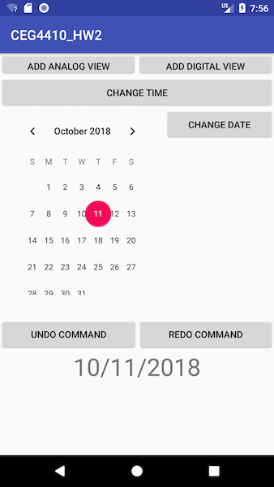
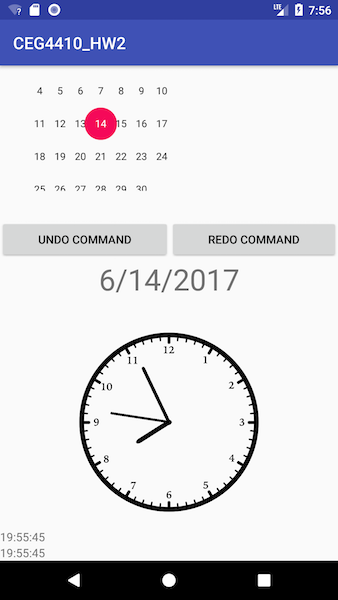

# CEG4110_HW2

<b>CEG-4110 HW 2: Clocks & Design Patterns</b>

This android application was made for the second homework assignment of CEG-4110: Intro to Software Engineering at Wright State University. It is an app where the user can insert analog clocks and digital clocks on the screen and modify the date and time for every present view.

Since I am still very inexperienced in Android Studio, programming and adding views dynamically to a layout was the hardest part for this assignment. While the design patterns are very intuitive, being able to develop a functional application along with these design implementations was the hardest part. Not only that, having to implement a digital clock view from scratch was a little tedious due to my lack of prior knowledge. 

# App Information:

<b>App Features:</b>

1) This application is presented in a scrolling view so the user can add as many clocks to the view. The user can add analog and digital clocks to the view. Not only that but all open views are updated at the same time.

2) User can change time and date accordingly on the open views. Once these changes occur, every present clock on the screen will update to the new times and the views will continue to update every second.

3) User can redo and undo actions. This means any time changes or date changes will be undone. The number of times a change can be undone or redone willl be unbounded

# Design Pattern Implementation Discussion:

<b>Model-View-Controller Design Pattern-</b>
Implementing this design pattern was very straight forward. I was able to do a rough outline in a couple hours and have the controller communicate with the model and view in a short period of time. I think the most difficult part is being and implementing this design in android because I am still inexperienced in android development. This pattern is worthwhile because it seperates the model, view, and controller. This seperation of responsibility is beneficial because it allows flexibility and code reuse. Since the view doesn't care about the model, you can expand your app to support multiple file formats-- the only thing you need to do is add model subclasses accordingly.

<b>Command Design Pattern-</b>
Implementing this design pattern was very straight forward. I was able to do a rough outline in a couple hours and have undos and redos implemented in a short amount of time. Like the Model-View-Controller pattern, I think the most difficult part is being and implementing this design in android because I am still inexperienced in android development. This pattern is worthwhile because it promotes code reusability, allows undo/redo implementations, and record possible metadata about command actions. Imlplementing  this pattern will allow for a more organized and usable code. 

# Resources I Used:

These are the sources I used to help implement the application.

<b> What I used to understand the MVC Design pattern:</b>
https://www.tutorialspoint.com/design_pattern/mvc_pattern.htm

<b> What I used to understand the Command Design pattern:</b>
https://www.tutorialspoint.com/design_pattern/command_pattern.htm

<b>Vector Analog Clock: </b>
https://github.com/TurkiTAK/vector-analog-clock

<b> TimePickerWithSeconds </b>
https://github.com/IvanKovac/TimePickerWithSeconds

# Dependencies:
<b>TO USE VECTOR ANALOG CLOCK LIBRARY:</b>
Include this line in build.gradle or build.gradle(Module: app)--

dependencies {
implementation 'turki.alkhateeb:vectoranalogclock:1.0.0'
}

<b>TO USE TIME PICKER LIBRARY:</b>
Include this line in build.gradle or build.gradle(Module: app)--

dependencies {
implementation  'com.kovachcode:timePickerWithSeconds:1.0.1'
}

