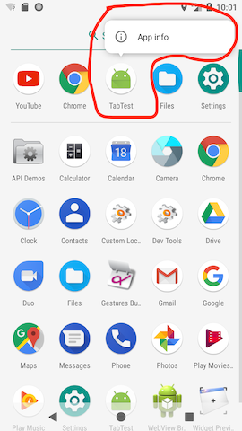
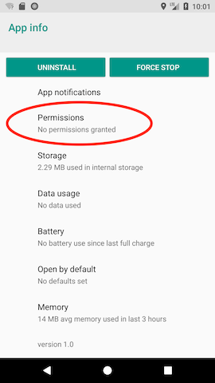
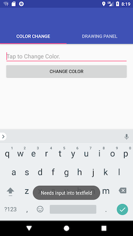
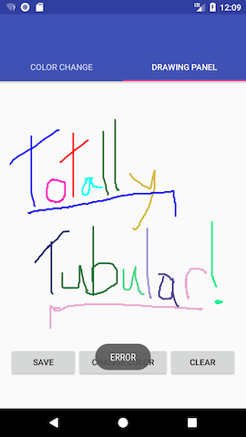

# CEG4110_HW1

CEG-4110 HW 1: Random Color Selector & Drawing Pad

This android application was made for the first homework assignment of CEG-4110: Intro to Software Engineering at Wright State University. It is a relatively simple app consisting of two activities: a random color selector and a drawing pad. 

The random color selector allows the user to enter text and changes the text to a random color and 
the drawing pad allows the user to draw images onto the screen with different colors. There is also save functionality implemented onto the drawing pad where the users can save their pictures. Users can switch between activities by swiping left or right or selecting the respective tab.

Before this homework assignment I had very little experience working with Android Studio, so it was very time consuming trying to get used to the Android Studio IDE and the gimmicks behind it. I also did not know how to import libraries so that was also a huge learning curve. I used many resources to help complete this project (credited in Resources I Used).

# App Information:

<b>App SETUP:</b>

-Copy the apk from the bin folder (provided by PILOT deliverable) onto usb and you should be good

If you want to save your drawings you MUST first grant app permissions for storage.

1) Select the app & select app info
2) Select permissions
3) Toggle the switch for storage
   
  
  
  
  
  
 
Now you can save your awesome drawings!!

<b>Activity 1- Random Color Selector:</b>

 This is the first activity where the user can enter a string in the textfield. Once the user selects the "CHANGE COLOR" button the string will change to a random color and display its respective RGB and Hex values. The textfield will only change text color as long as it is populated. Else, it will throw an error message and prompt the user for input.
       
 
 
 
 

        
<b>ACTIVITY 2- Drawing Pad:</b>
 
 This is the second activity where the user can draw images onto the screen. Besides drawing, the user can also change brush color, save pictures (as long as they followed APP SETUP instructions), and clear their drawings. If the user did not follow APP SETUP instructions, they will not be able to save their picture (An error message will pop up indicating that they need external permissions). The user can also draw many paths with different colors.
           

# Software Design Discussion:

 <b>Random Color Selector-</b>
        I implemented the random color generator by declaring a random and generated random int values for 3 ints (These are for the RGB values). I then used the 3 RGB values to declare the new color. Finally I set the text color to the new color and got its hex representation by calling Integer.toHexString(color). To display the RGB and hex values, I set those variables to a label.
 
<b>Drawing Pad-</b>
        In order to implement the Drawing Pad, I used a tutorial to show me how to create the drawing mechanism. Before this assignment, I had no prior experience at implementing a paint app so I had to use external resources for help. 

 # Resources I Used:
 
  <b> What I used to implement the drawing pad:</b>
            https://code.tutsplus.com/tutorials/android-sdk-create-a-drawing-app-touch-interaction--mobile-19202

  <b>AmbilWarna Color Picker Library: </b>  
            https://github.com/yukuku/ambilwarna
                  
  <b>TO USE AMBILWARNA LIBRARY:</b>
            In build.gradle(Module: app)
            
                dependencies {
                implementation 'com.github.yukuku:ambilwarna:2.0.1'
                }

      
    

